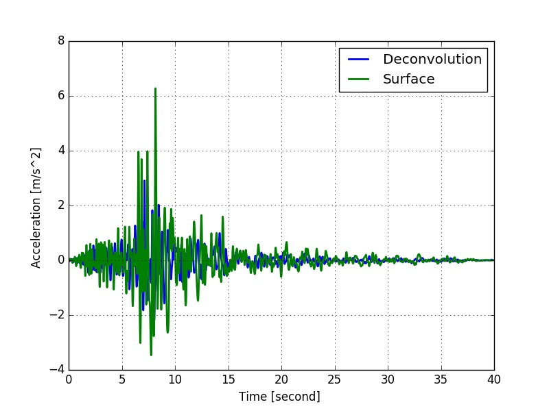
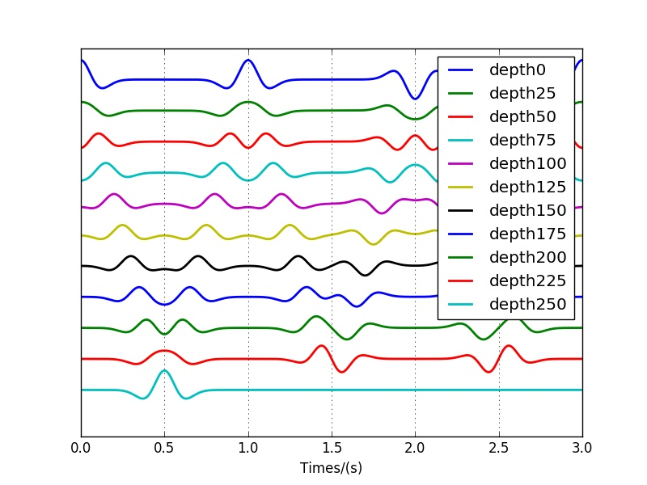

## Wave Propagation in C++
This is an implementation of 1D wave propagation in C++.

#### Explanation
The wave field class builds a wave field according to the input motions and the soil profile properties. 
As long as the motion at a certain depth is known, the motions at all other depths can be calculated. 


#### Run the example
```bash
cd ./example/ex1
./run_test_deconv.sh
cd ../ex2
./run_test_deconv.sh
```


#### Features
* Wave deconvolution.
* Wave convolution.
* Wave propagation within soil layer.
* Wave propagation from equivalent rock outcropping.
* Input motion can be either at surface or at a certain depth.
* Build multi-direction wave fields to interact with other classes.


#### Examples


**Result: deconvolution **

 

**Result: upward wave propagation ** 

 

#### Useful Helper
- FFT and inverse FFT by C++ and std::complex.
- Remove Comments for C/C++ Code by C++ code.


